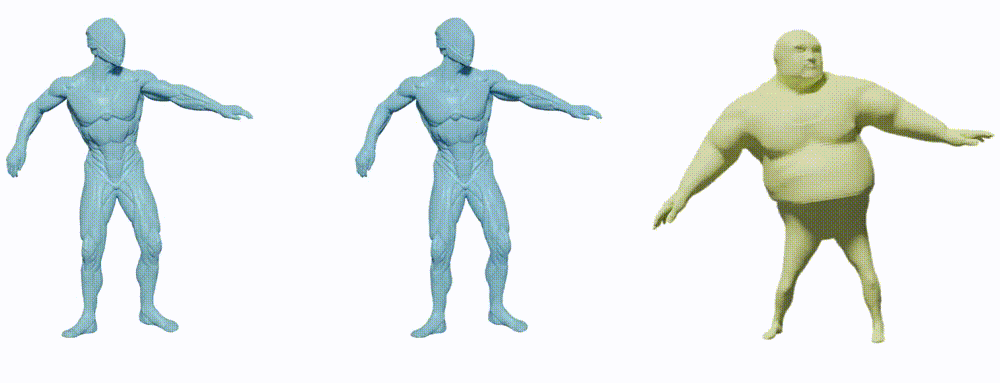

## Non-rigid Point Cloud Registration with Neural Deformation Pyramid [[Paper](http://arxiv.org/abs/2205.12796)]

Hierarchical non-rigid registration of multiple scans


Scale variant non-rigid registration with Sim(3) warp field




### Requirements

The code tested on python=3.8.10, pytorch=1.9.0 with the following packages:
- pytorch3d, open3d, opencv-python, tqdm, mayavi, easydict

 

### Obtain the 4DMatch benchmark
- Download the train/val/4DMatch-F/4DLoMatch-F split, [(google drive, 14G)](https://drive.google.com/file/d/1ySykuxxRyE-OvFY8gDgE_SoacKbexMDz/view?usp=sharing). We filter point cloud pairs with near-rigid motions from the original 4DMatch benchmark.  4DMatch-F & 4DLoMatch-F denote the filtered benchmark.
- Extract it and create a soft link under this repository.
```shell
ln -s /path/to/4Dmatch  ./data
```


### Reproduce the result of NDP (no-learned)
- Run
```eval
python eval_nolearned.py --config config/NDP.yaml  
```
To visualize the registration result, add ```--visualize```.


### Reproduce the result of LNDP (supervised)
- First download pre-trained point cloud matching and outlier rejection models [(google drive, 271M)](https://drive.google.com/file/d/1T8z71iv3dvyAQhZUgct0w5yDtfRFwui9/view?usp=sharing). Move the models to ``correspondence/pretrained``
- Install KPConv
```shell
cd correspondence/cpp_wrappers; sh compile_wrappers.sh; cd ../..
```
- Finally run
```
python eval_supervised.py --config config/LNDP.yaml  
```
To visualize the registration result, add ```--visualize```.

 

### Run  shape transfer example
```
python shape_transfer.py -s sim3_demo/AlienSoldier.ply -t sim3_demo/Ortiz.ply
```

### Our related projects 

Lepard: [rabbityl/lepard](https://github.com/rabbityl/lepard)  
DeformingThings4D: [rabbityl/DeformingThings4D](https://github.com/rabbityl/DeformingThings4D) 

### Citation
If you use our code please cite:
```text
@article{li2022DeformationPyramid, 
    title={Non-rigid Point Cloud Registration with Neural Deformation Pyramid.}, 
    author={Yang Li and Tatsuya Harada},
    journal={arXiv preprint arXiv:2205.12796},
    year={2022}
}
```


